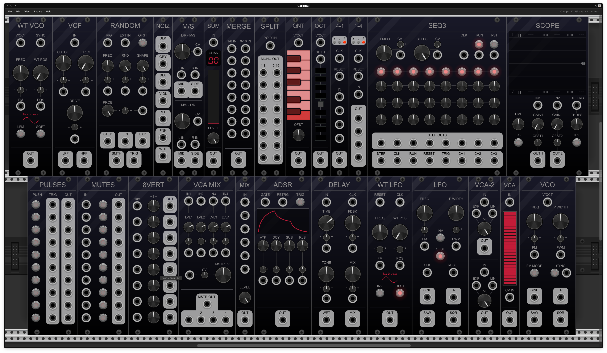

# Fundamental (alternative panel design)

The Fundamental plugin pack gives you a basic foundation to create simple synthesizers,
route and analyze signals, complement other more complicated modules,
and build some not-so-simple patches using brute force (lots of modules).
They are also a great reference for creating your own plugins in C++.

This repository contains a fork of [VCV Fundamental](https://github.com/VCVRack/Fundamental) with an alternative panel design.

Contrary to the original VCV project, pull requests for changes, fixes etc are welcome!
Just note that compatibility with the original is required, though it only needs to be one way (from original to fork).

## Building

Follow the build instructions for VCV Rack plugins at https://vcvrack.com/manual/Building.html#building-rack-plugins.

## License

The original source code is copyright © 2016-2021 Andrew Belt.

The new panels are copyright © 2022 Jason Corder and Filipe Coelho, with included piano keyboard by Thorsten Wilms, licensed under `GPL-3.0-or-later`.

This program is free software: you can redistribute it and/or modify it under the terms of the [GNU General Public License](https://www.gnu.org/licenses/gpl-3.0.en.html) as published by the [Free Software Foundation](https://www.fsf.org/), either version 3 of the License, or (at your option) any later version.
