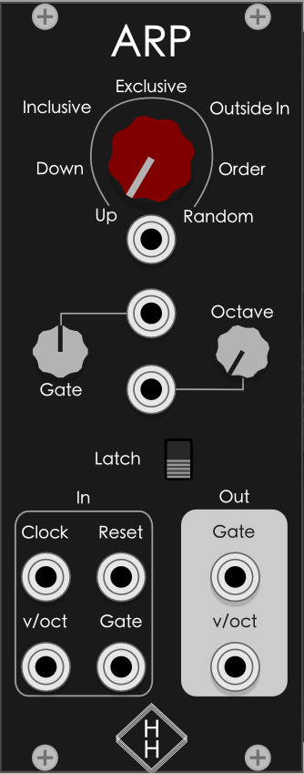
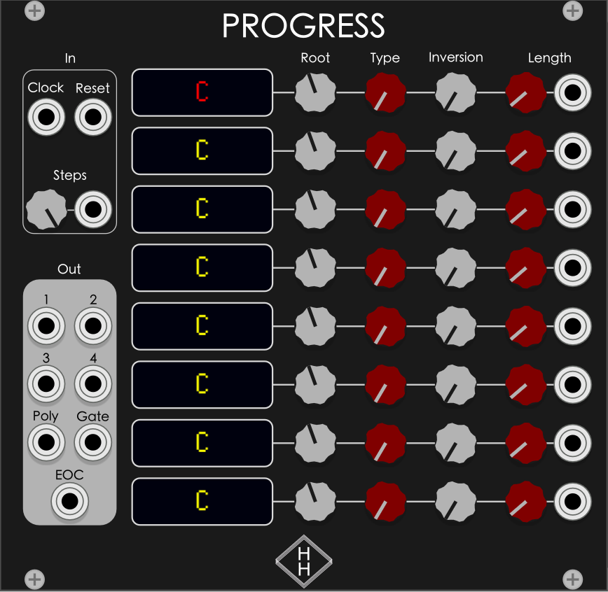

# Hampton Harmonics

Modules for [VCV Rack](https://vcvrack.com)

---

## Modules

- [Arp](#arp)
- [Progress](#progress)

### Arp

A polyphonic input arpeggiator

#### Arp Inputs

- Clock - Takes a clock trigger as input. Necessary for running the arpeggiator.
- Reset - Takes a reset trigger as input. Resets the sequence back at step 1.
- v/oct - Takes a polyphonic v/oct input signal; these pitches are used in the sequence
- Gate - Takes a polyphonic gate input signal. If a pitch has a corresponding gate attached to it, then the note will be included in the sequence.
- Pattern CV - Takes a CV input to control the arpeggiator pattern.
- Gate CV - Takes a CV input to control the length of the outputted gate.
- Octave CV - Takes a CV input to control how many octaves are in the sequence.

#### Arp Outputs

Under default settings:

- Gate - Outputs a monophonic gate trigger
- v/oct - Outputs a monophonic v/oct pitch

With polphonic output setting enabled:

- Gate - Outputs a polyphonic gate trigger, but only one channel is triggered at each step
- v/oct - Outputs a monophonic v/oct pitch, but only one channel is sent to each step

#### Arp Knobs

- Pattern - Used to choose between the following patterns
  - Up - Notes are played from lowest to highest
  - Down - Notes are played from highest to lowest
  - Inclusive - Notes are played from lowest to highest, then highest to lowest; the bottom and top notes are played twice
  - Exclusive - Notes are played from lowest to highest, then highest to lowest; the bottom and top notes are played only once
  - Outside In - Notes are played lowest then highest, then second lowest and second highest, and so forth until they meet in the middle
  - Order - Notes are played in the order that they come in
  - Random - Notes are played randomly
- Gate - Used to control the length of the outputted gate
- Octave - Used to control how many octaves are featured in the sequence. 1 - 4 octaves are available.
- Latch - Used to hold the notes entered in the sequence so you don't have to hold the keys down yourself. The saved notes reset when you let go of all notes and play new notes.

#### Arp Menu Settings

- Output Mode
  - Enabling polyphonic output will rotate each individual step through each of the max 16 polyphonic channels. This allows for longer envelopes without being cut off at the next step. The mix can get messy and distorted if envelopes are too long for each step, so use with care.

### Progress

A polyphonic sequencer for building chord progressions.

#### Progress Inputs

- Clock - Takes a clock trigger as input. Necessary for running the sequencer.
- Reset - Takes a reset trigger as input. Resets the sequence back at step 1.
- Steps - Takes a CV input to modulate the number of steps the sequence should take.
- Length - Takes a CV input to modulate the length of each step. Length is defined as number of triggers received from the clock.

#### Progress Outputs

- 1 - Outputs the pitch of the root note of the chord regardless of inversion.
- 2 - Outputs the pitch of the second note of the chord regardless of inversion.
- 3 - Outputs the pitch of the third note of the chord regardless of inversion.
- 4 - Outputs the pitch of the fourth note of the chord regardless of inversion.
- Poly - Outputs all 4 notes of the chord in one polyphonic output.
- Gate - Outputs a polyphonic gate output for each step of the sequence.
- EOC - Outputs a trigger pulse on the first step after each full cycle has completed.

#### Progress Sequence

The screen will show the chord's root note, chord type, and inversion bass note.

The "Root" knob decides the root note and octave chosen.

The "Type" knob decides the type of the chord from the following options:

- Major (default and not displayed on screen)
- Minor ("m")
- Major 7 ("MAJ7")
- Dominant 7 ("7")
- Minor 7 ("m7")
- Suspended 2nd ("sus2")
- Suspended 4th ("sus4")
- Diminished ("dim")
- Augmented ("+")

_Note_ If a chord is normally played as a triad, meaning there is no fourth note played, the polyphonic output will only output three notes. The output "4" will however play the same note as the root note.

The "Inversion" knob chooses which note will be played as the bass note, or bottom note. It handles this by raising the previous bass note up an octave. So if you want to play "C/E" chord but you want to keep the root "C" note in the same octave, you'll have to lower the root note down an octave.

The "Length" knob chooses how many beats from the clock will be triggered before going to the next step in the sequence. This is handy for making more complex chord progressions. This value goes up to 16. You can also choose the value "0", in which case the step will be skipped entirely.

## Development Notes

SVG Font is Heiti TC.
