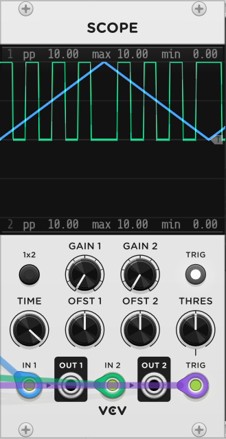

# Phasor to Clock

This simple module takes an incoming phasor signal and breaks it into many pulses and phasors.

STEPS - This sets the number of pulses generated by one cycle of the incoming phasor.

WIDTH - This sets the pulse width of the pulses present on the CLOCK output.

### Gate Detection Mode
Multiple phasor-processing modules in HetrickCV contain a switch to change between Raw and "Smart" gate detection.

For gate detection, a 0-10V phasor is divided by 10 to create a value between 0.0 and 1.0. The value of the phasor is then compared against the Pulse Width value (usually 50%, or 0.5). If the phasor's value is less than the PW value, the gate is output as true, or 10V. This is generally reliable, but certain conditions can provide unwanted output.

**Raw**: The output is calculated purely using the algorithm described above. In the image below, you can see that this causes issues with reverse phasors, ping-pong phasors, or phasors that are "stopped" (0.0 and not moving). For stopped phasors, a gate output will be 10V since the phasor will be at the very beginning of its cycle. For reverse phasors, the position of the gate will be phase-reversed, potentially causing out-of-sync rhythms.

**Smart**: The pulse detection algorithm first determines if the phasor is moving at all. If the phasor isn't moving, the output is set to zero. Next, the algorithm detects if the phasor is ascending or descending. If the phasor is descending, it flips the pulse width calculation. In the image below, you can see that a pingpong/triangle phasor will output perfectly even gates.

#### Raw Mode

#### Smart Mode
