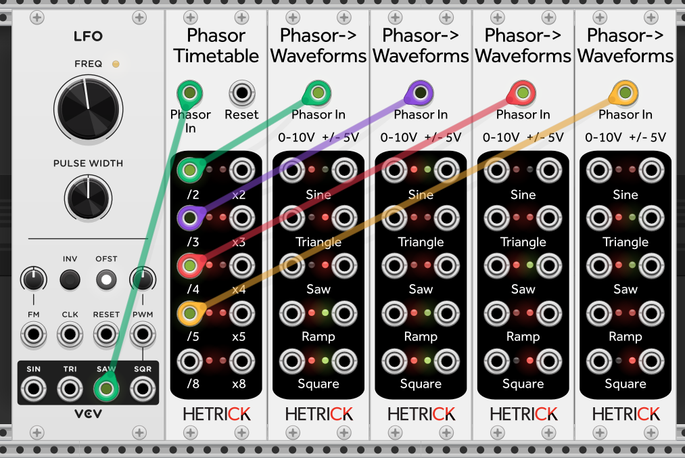
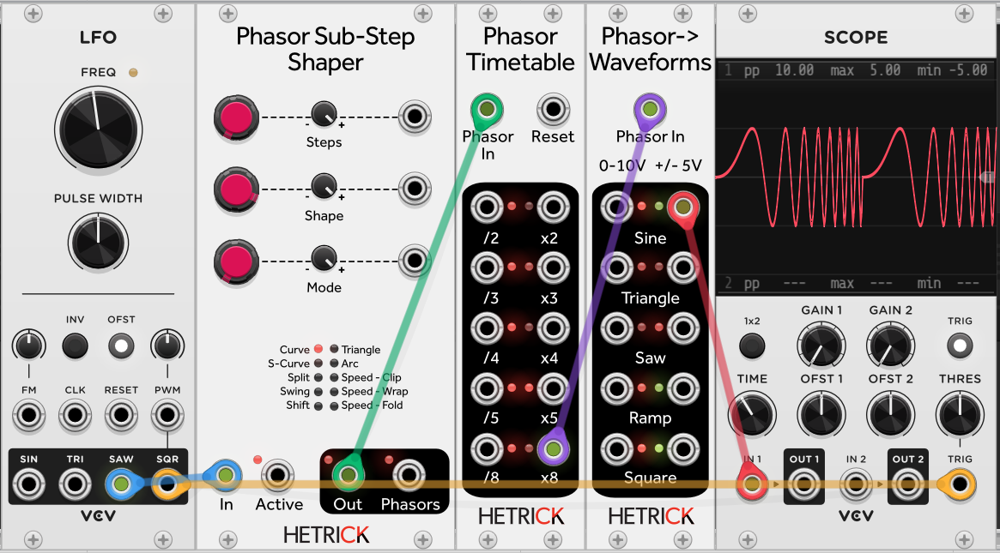
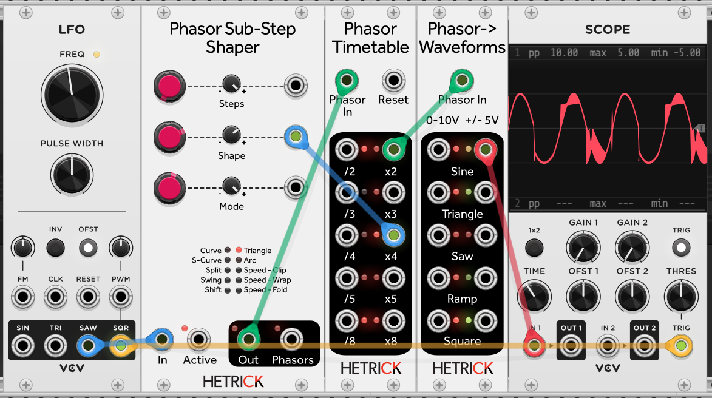
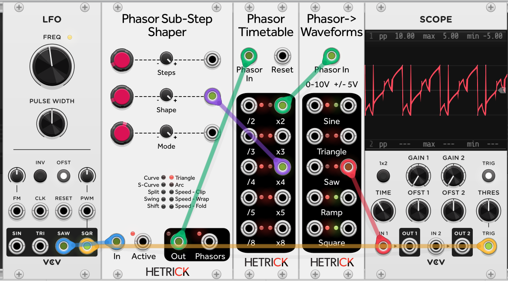
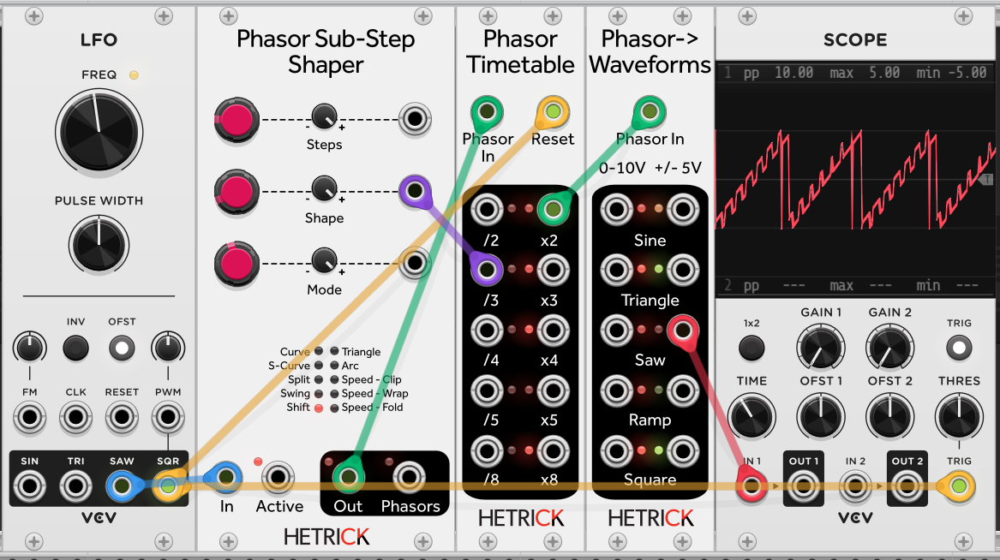
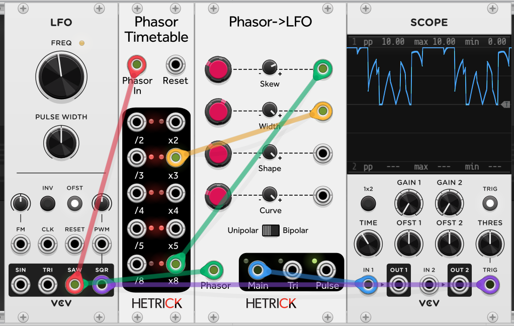
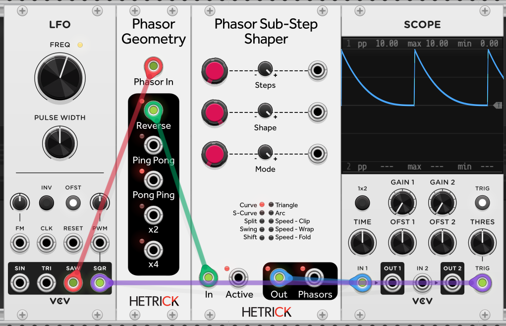
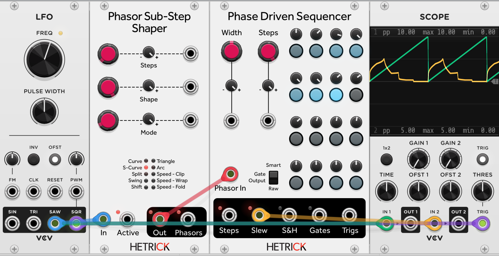

# Phase-Based Sequencing Tutorial 5 - Phasors as Modulation

In the last few tutorials, we focused on using phasors to look up sequence data. You may have already had the thought that using the VCV LFO gives us three additional modulation waveforms (Sine, Triangle, and Square) that are time-synced to our sequences.

## Modulation Timetable

As you saw in the sequencing tutorials, one of the most useful features of phasors is that they're extremely easy to sync. It can sometimes be very frustrating syncing up a number of traditional modulation modules, so let's start with a simpler way to do that.

In the patch above, I've connected the VCV LFO to [Phasor Timetable](../../Modules/PhasorTimetable.md). I've then connected various division outputs into [Phasor to Waveforms](../../Modules/PhasorToWaveforms.md). We now have four sets of simultaneous unipolar and bipolar LFOs ready to go! If that's too unwieldy, it is important to note that all of the HetrickCV modules support [VCV Polyphony](https://vcvrack.com/manual/Polyphony).

For simplicity, I will continue using monophonic patching in these tutorials.

## Sculpting the Waves

While that's handy, it might not be exciting having all of the waveforms that exist on practically every other LFO. Let's bend them!

We're going to break out the [Phasor Sub-step Shaper](../../Modules/PhasorShape.md) again. This time, we will place it between the LFO and the Timetable.

Now, start to play with the Shape control. You will see your sine wave skew with one slow cycle and one fast cycle.

Each of the timetable outputs is reacting differently to the skewed incoming phasor. Compare the 4x output:

And the 8x output:

Additionally, we can skip the Timetable completely and just plug the Substep Shaper output directly into the Waveforms module.

You can certainly spend a lot of time experimenting with what order you place these modules together in a chain! Go ahead and experiment with the different modes and outputs. It's going to get even weirder.

## Feedback is Fun

Now that we have a bunch of synced-up modulation sources, let's cause a bit of chaos. Plug one of the Timetable outputs back into the Shaper's Shape CV Input.

What's great here is that you can really dive into some very experimental waveforms, but the output will remain synced to the phasor input. In many instances, this feedback will lead to some high-frequency bursts:

You can reduce this by changing the number of steps on the Sub-Step Shaper:

You can also use divider outputs on the Timetable. You can lock these modulations to your main phasor by resetting the Timetable with the main LFO's Square output:

Another extremely useful module is the [Phasor to LFO](../../Modules/PhasorToLFO.md). This module accepts a phasor and creates useful modulation outputs in squares, trapezoids, sines, saws, windows... all sorts of shapes. The kicker is all of this is continuously morphing. This excellent design is taken from a recipe in [Generating Sound and Organizing Time](https://cycling74.com/books/go), which I cannot recommend enough to creative developers.

In the patch above, I've continued the experiment of feedback patching via the use of Phasor Timetable. You can find all sorts of incredible shapes by exploring this module.

## Phasors as Envelopes

We can save a lot of patching by using our phasors directly as envelopes. The simplest recipe is a Decay Envelope. We can build this by reversing our phasor and then changing the curve. This is easily done with [Phasor Geometry](../../Modules/PhasorGeometry.md) and the Sub-Step Shaper.

In the patch above, I've reversed the phasor (so that it starts at 10V), and then applied the Curve algorithm to make the decay more exponential. This will be even more useful in the next chapter when we explore rhythmic phasor generators. If a decay envelope is not enough, we can "draw" an envelope using the Slew output of the [Phase Driven Sequencer](../../Modules/PhaseDrivenSequencer.md).

We can essentially draw the shape of our envelope as a series of points using the sequencer's voltage knobs. We then smoothly navigate through these points by using the slew output from the Phase Driven Sequencer. The slew between the steps is directly controlled by the position of the input phasor, so we can create different point transitions by using the Sub-Step Shaper.

I can warp the entire envelope by setting Steps to 1:

Or I can change the way the envelope slews between sequencer steps by increasing the number of shaper Steps:

## Euclidean... LFOs?!
Yes, those are possible! We will dive in with the next tutorial.

Next Tutorial: [6 - Navigating Rhythmic Space](./6-NavigatingRhythmicSpace.md)

