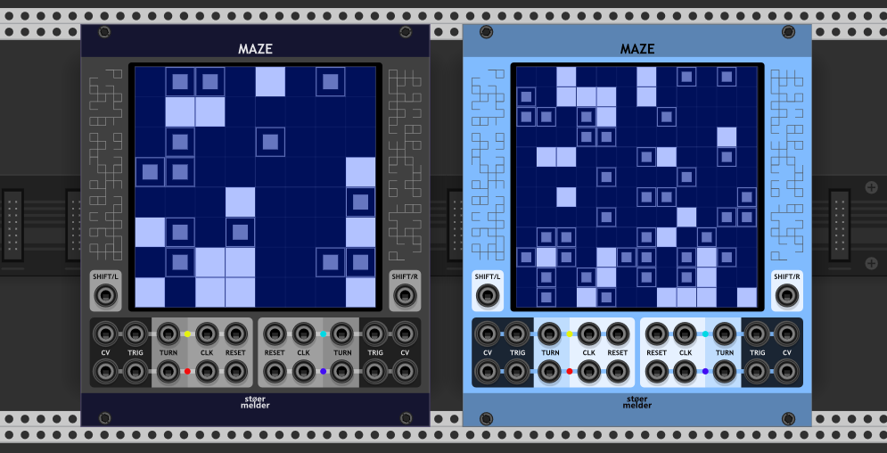
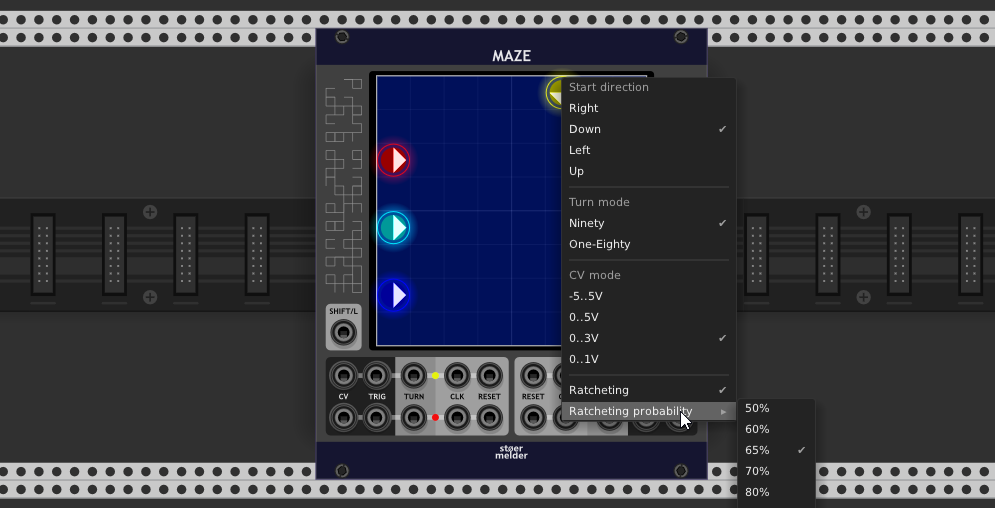
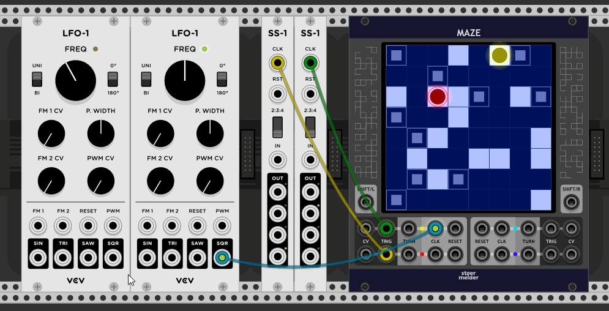
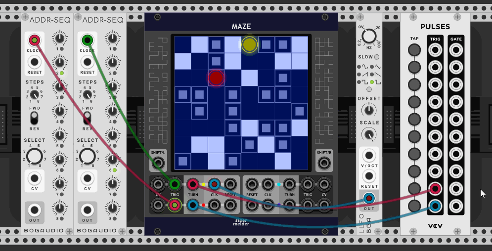
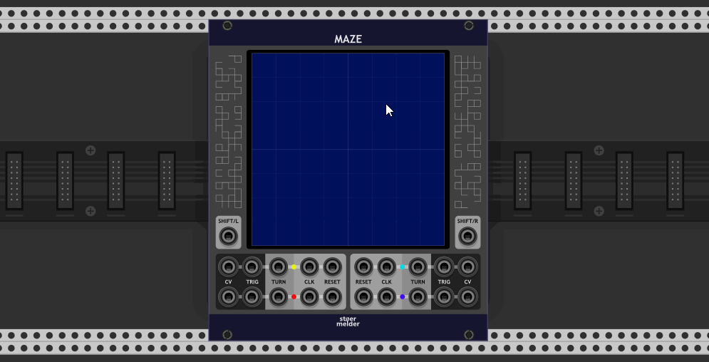

# stoermelder MAZE

MAZE is a random ratcheting sequencer with 4 independent outputs which run on a common 2-dimensional grid. This module is all about randomness and limitations, so you can't control everything.

[Live stream](https://www.youtube.com/watch?v=pOcYGj1Qb9M) of [Omri Cohen](https://omricohencomposer.bandcamp.com/) using MAZE for sequencing.

## The grid

The grid is the main part of MAZE with up to four color-coded "playheads". Playheads are visible and enabled if one of their ports CV or TRIG outputs are connected. Each cell of the grid can have one of three states:

- Off: No trigger is raised when a playhead enters the cell.
- Filled: A trigger is raised on every entering.
- Half: The incoming clock signal is multiplied by a randomly chosen factor and multiple gate pulses are sent to the TRIG-port generating a ratcheting sequence. Although the exact number of triggers cannot be controlled there is a probability setting for each playhead to influence the geometric distribution in use for generating the number of gates: Higher percent-values mean that bigger factors of clock multiples are more likely.

If "Ratcheting" is disabled by context menu option of a playhead (see 
*Edit-mode* below) each half filled cell generates one single gate pulse with probability of 50%.  

Since v1.9.0 there is an additional setting for controlling the behavior of the ratchets:

- Twos: Only even number of ratchets are generated.
- Threes: Only numbers of ratchets divideable by three are generated.
- Power of 2: The number of ratchets is a power of 2. Be aware that this setting can generate huge amounts of ratchets per clock-tick.

A mouse click into a grid cell cycles through the three different states. Additionally each cell holds a randomly choosen CV value that is sent to the CV port everytime a trigger is raised. The CV value of a cell cannot be changed manually but each cycle of the cell-states sets a new value. While the number of triggers of half cells is randomly chosen everytime a playhead enters them the CV values are constant.

The grid can be sized from 2x2 up to 32x32 with the slider on the context menu. The cells can also be randomized or randomized with "certainty" which generates no half filled cells.

## _CLK_ and _RESET_ ports

Each playhead has his own clock and reset port. Every clock-trigger moves the playhead one cell forward according to the current progressing direction. A reset-trigger returns the playhead to its start position which can be set on the *Edit-mode* of the grid. Triggers on _CLK_ and _RESET_ of the yellow channel are normalized to the other ports if no cable is connected. Normalization can also be disabled (since v1.6.0).

## _TURN_ ports 

A trigger on the _TURN_-port turns the current progressing direction of the playhead 90 degrees to the right or 180 degrees (this setting is found in *Edit-mode*). Triggers of the yellow channel are normalized to the other ports. Normalization can also be disabled (since v1.6.0).

## _SHIFT/L_ and _SHIFT/R_ ports

Triggers on _SHIFT/L_ or _SHIFT/R_ shift all playheads one lane to the left or to the right, respectively, according to the current progressing direction. It is a deliberate limitation of the module that shifts are only possible on all channels the same time.

## Edit-mode of the grid

The grid can be switched to *Edit-mode* on the context menu. While in *Edit-mode* the reset-positions of each playhead can be modified by drag and drop. Everytime RESET is triggered the respective playhead will return to this cell on the grid.

There are additional settings on the context menu of each playhead:

* Start progressing direction: Right (default), Left, Up, Down
* Behavior of TURN-triggers: 90 degrees (default) or 180 degrees
* Output range of the respective CV-port, default is 0..3V
* Ratcheting (since v1.6.0, more options since v1.9.0)
* Ratcheting probability (since v1.6.0)

## Tips

* The module works with Rack's undo-functionality for all changes of the grid.
* Some deliberate limitations have been set for this module:
  * The grid can’t be randomized or changed by CV.
  * The size of the grid can't be changed by CV.
  * You have no control over ratchets (but they can be disabled completely).
  * 90 degree-turns are only to the right.
  * CV values cannot be set manually.
* The module continues its normal operation while in *Edit-mode*.

MAZE was added in v1.3 of PackOne.